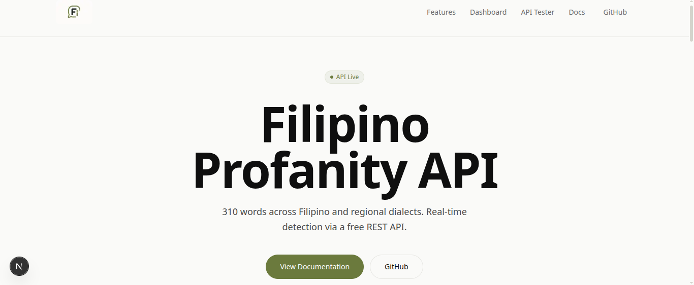

<div align="center">



# Filipino Profanity API

**310 words across Filipino and regional dialects. Real-time detection via a free REST API.**

[](https://opensource.org/licenses/MIT)
[](https://nextjs.org/)
[](https://www.typescriptlang.org/)
[](https://filipino-profanity-api-latest.vercel.app/)

[View Documentation](https://filipino-profanity-api-latest.vercel.app/docs) | [Report Bug](https://github.com/jobelGolde12/filipino_profanity_api_latest/issues) | [API Playground](https://filipino-profanity-api-latest.vercel.app/#api-tester)

</div>

---

## Overview

The Filipino Profanity API is a free, open-source REST API designed for developers building Filipino-language applications that need content moderation. It provides real-time detection of profanity words across Filipino and regional dialects (Visayan), with support for text masking, batch processing, and detailed statistics.

### Key Highlights

- **310 profanity words** — 110 Filipino + 200 Regional (Visayan)
- **Real-time detection** — Check any text for profanity instantly
- **Text masking** — Automatically censor profanity with `***` or custom characters
- **Batch processing** — Check multiple texts in a single request
- **Rate limiting** — Built-in protection against abuse
- **JSON fallback** — Works without database configuration
- **Pagination** — Efficient data retrieval for large datasets

---

## Quick Start

### Prerequisites

- Node.js 18+
- npm, yarn, or pnpm

### Installation

```bash
# Clone the repository
git clone https://github.com/jobelGolde12/filipino_profanity_api_latest.git
cd filipino_profanity_api

# Install dependencies
npm install

# Start development server
npm run dev
```

Open [http://localhost:3000](http://localhost:3000) to view the application.

### Production Build

```bash
npm run build
npm start
```

---

## API Endpoints

Base URL: `https://filipino-profanity-api-latest.vercel.app/api`

### Health Check

Check API status and database connectivity.

```bash
curl https://filipino-profanity-api-latest.vercel.app/api/health
```

**Response:**
```json
{
  "status": "ok",
  "timestamp": "2025-01-19T12:00:00.000Z",
  "uptime": 3600.5,
  "database": {
    "connected": true,
    "wordCount": 310
  },
  "version": "1.0.0",
  "responseTime": "12ms"
}
```

---

### Fetch Profanity Words

Retrieve profanity words with optional filtering and pagination.

```bash
# Fetch all words
curl https://filipino-profanity-api-latest.vercel.app/api/profanity

# Filter by language
curl "https://filipino-profanity-api-latest.vercel.app/api/profanity?type=filipino"

# Search for a specific word
curl "https://filipino-profanity-api-latest.vercel.app/api/profanity?word=gago"

# Paginate results
curl "https://filipino-profanity-api-latest.vercel.app/api/profanity?page=1&limit=25"
```

**Parameters:**

| Parameter | Type | Default | Description |
|-----------|------|---------|-------------|
| `type` | string | `all` | Filter: `filipino`, `regional`, or `all` |
| `word` | string | - | Search for a specific word |
| `page` | integer | `1` | Page number |
| `limit` | integer | `50` | Items per page (max: 200) |

**Response:**
```json
{
  "success": true,
  "type": "all",
  "count": 50,
  "source": "database",
  "pagination": {
    "page": 1,
    "limit": 50,
    "total": 310,
    "totalPages": 7,
    "hasNext": true,
    "hasPrev": false
  },
  "data": [
    {
      "word": "gago",
      "language": "filipino",
      "region": null,
      "severity": "medium"
    }
  ]
}
```

---

### Check Text for Profanity

Analyze text and detect profanity words.

```bash
curl -X POST https://filipino-profanity-api-latest.vercel.app/api/check \
  -H "Content-Type: application/json" \
  -d '{"text": "This text contains gago"}'
```

**Request Body:**

| Field | Type | Required | Description |
|-------|------|----------|-------------|
| `text` | string | Yes | Text to check for profanity |

**Response:**
```json
{
  "success": true,
  "hasProfanity": true,
  "count": 1,
  "data": [
    {
      "word": "gago",
      "language": "filipino",
      "region": null,
      "severity": "medium"
    }
  ]
}
```

---

### Batch Text Checking

Check multiple texts for profanity in a single request.

```bash
curl -X POST https://filipino-profanity-api-latest.vercel.app/api/check/batch \
  -H "Content-Type: application/json" \
  -d '{"texts": ["Hello world", "You are gago"]}'
```

**Request Body:**

| Field | Type | Required | Description |
|-------|------|----------|-------------|
| `texts` | string[] | Yes | Array of texts (max: 10, each max 5,000 chars) |

**Response:**
```json
{
  "success": true,
  "totalTexts": 2,
  "textsWithProfanity": 1,
  "results": [
    {
      "text": "Hello world",
      "hasProfanity": false,
      "count": 0,
      "data": []
    },
    {
      "text": "You are gago",
      "hasProfanity": true,
      "count": 1,
      "data": [
        {
          "word": "gago",
          "language": "filipino",
          "region": null,
          "severity": "medium"
        }
      ]
    }
  ]
}
```

---

### Text Masking

Mask profanity words with asterisks or custom characters.

```bash
curl -X POST https://filipino-profanity-api-latest.vercel.app/api/mask \
  -H "Content-Type: application/json" \
  -d '{"text": "You are a gago", "maskChar": "*", "partial": true}'
```

**Request Body:**

| Field | Type | Default | Description |
|-------|------|---------|-------------|
| `text` | string | required | Text to mask (max 10,000 chars) |
| `maskChar` | string | `*` | Single character for masking |
| `partial` | boolean | `true` | Keep first letter visible (e.g., `g***`) |

**Response:**
```json
{
  "success": true,
  "original": "You are a gago",
  "masked": "You are a g***",
  "matchCount": 1,
  "matches": ["gago"],
  "details": [
    {
      "word": "gago",
      "start": 10,
      "end": 14,
      "original": "gago",
      "masked": "g***"
    }
  ]
}
```

---

### Statistics

Get word counts by language, severity, and region.

```bash
curl https://filipino-profanity-api-latest.vercel.app/api/stats
```

**Response:**
```json
{
  "success": true,
  "total": 310,
  "byLanguage": {
    "filipino": { "count": 110, "percentage": 35 },
    "regional": { "count": 200, "percentage": 65 }
  },
  "bySeverity": {
    "low": 0,
    "medium": 310,
    "high": 0
  },
  "byRegion": {
    "none": 110,
    "visayan": 200
  },
  "source": "database"
}
```

---

## Code Examples

### JavaScript / Fetch

```javascript
// Fetch all profanity words
const response = await fetch('https://filipino-profanity-api-latest.vercel.app/api/profanity');
const data = await response.json();
console.log(data);

// Check text for profanity
const checkResponse = await fetch('https://filipino-profanity-api-latest.vercel.app/api/check', {
  method: 'POST',
  headers: { 'Content-Type': 'application/json' },
  body: JSON.stringify({ text: 'Your text here' }),
});
const result = await checkResponse.json();
```

### Python

```python
import requests

# Fetch all profanity words
response = requests.get('https://filipino-profanity-api-latest.vercel.app/api/profanity')
data = response.json()
print(data)

# Check text for profanity
response = requests.post(
    'https://filipino-profanity-api-latest.vercel.app/api/check',
    json={'text': 'Your text here'}
)
result = response.json()
```

### cURL

```bash
# Fetch all words
curl https://filipino-profanity-api-latest.vercel.app/api/profanity

# Check text
curl -X POST https://filipino-profanity-api-latest.vercel.app/api/check \
  -H "Content-Type: application/json" \
  -d '{"text": "Your text here"}'

# Mask profanity
curl -X POST https://filipino-profanity-api-latest.vercel.app/api/mask \
  -H "Content-Type: application/json" \
  -d '{"text": "Your text here"}'
```

---

## Rate Limiting

All endpoints (except `/api/health`) are rate-limited per IP address:

| Endpoint | Limit | Window |
|----------|-------|--------|
| `GET /api/profanity` | 60 requests | 1 minute |
| `GET /api/stats` | 60 requests | 1 minute |
| `GET /api/health` | No limit | - |
| `POST /api/check` | 30 requests | 1 minute |
| `POST /api/mask` | 30 requests | 1 minute |
| `POST /api/check/batch` | 20 requests | 1 minute |

**Rate Limit Headers:**

| Header | Description |
|--------|-------------|
| `X-RateLimit-Limit` | Maximum requests per window |
| `X-RateLimit-Remaining` | Requests remaining |
| `X-RateLimit-Reset` | Unix timestamp when window resets |
| `Retry-After` | Seconds to wait (only on 429) |

---

## Database Setup (Optional)

The API works out of the box with bundled JSON data. For production use with Turso database:

1. Create a Turso account at [turso.tech](https://turso.tech)

2. Create a database:
   ```bash
   turso db create filipino-profanity
   ```

3. Get credentials:
   ```bash
   turso db show filipino-profanity --url
   turso auth token
   ```

4. Create `.env` file:
   ```env
   TURSO_DATABASE_URL=libsql://your-db.turso.io
   TURSO_AUTH_TOKEN=your-auth-token
   ```

5. Seed the database:
   ```bash
   npx tsx scripts/seed.ts
   ```

---

## Tech Stack

| Component | Technology |
|-----------|------------|
| Framework | [Next.js 16](https://nextjs.org/) |
| Language | [TypeScript 5](https://www.typescriptlang.org/) |
| Styling | [Tailwind CSS v4](https://tailwindcss.com/) |
| Database | [Turso](https://turso.tech/) (libSQL) |
| Icons | [Lucide React](https://lucide.dev/) |
| Charts | [Nivo](https://nivo.rocks/) |
| Animations | [Framer Motion](https://www.framer.com/motion/) |

---

## Project Structure

```
filipino_profanity_api/
├── app/
│   ├── api/
│   │   ├── health/route.ts      # Health check endpoint
│   │   ├── profanity/route.ts   # Fetch profanity words
│   │   ├── check/
│   │   │   ├── route.ts         # Check single text
│   │   │   └── batch/route.ts   # Batch text checking
│   │   ├── mask/route.ts        # Text masking
│   │   ├── stats/route.ts       # Statistics endpoint
│   │   └── reports/             # Bug reports
│   ├── docs/page.tsx            # API documentation
│   └── page.tsx                 # Landing page
├── components/                  # React components
├── lib/
│   ├── rate-limit.ts            # Rate limiting middleware
│   └── turso.ts                 # Database client
├── api/
│   ├── pure_filipino.json       # Filipino profanity words
│   └── regional.json            # Regional profanity words
└── scripts/
    └── seed.ts                  # Database seeding
```

---

## Contributing

Contributions are welcome! Please feel free to submit a Pull Request.

1. Fork the repository
2. Create your feature branch (`git checkout -b feature/amazing-feature`)
3. Commit your changes (`git commit -m 'Add amazing feature'`)
4. Push to the branch (`git push origin feature/amazing-feature`)
5. Open a Pull Request

---

## License

This project is licensed under the MIT License - see the [LICENSE](LICENSE) file for details.

---

## Support

- [Documentation](https://filipino-profanity-api-latest.vercel.app/docs)
- [Report Bug](https://github.com/jobelGolde12/filipino_profanity_api_latest/issues)
- [GitHub Repository](https://github.com/jobelGolde12/filipino_profanity_api_latest)

---

<div align="center">

**Built with care for the Filipino developer community**

</div>
